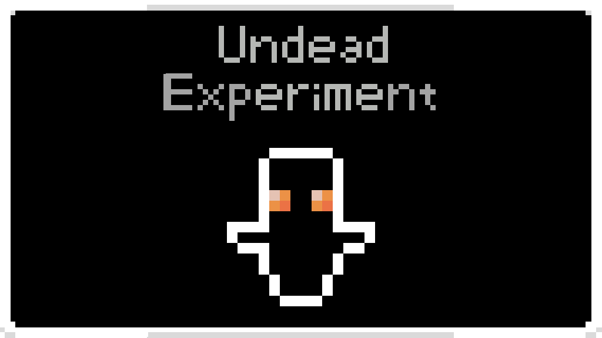


# Undead Experiment
A simple mod, like ever second run `heal` command.

Configs `blackmoss.undeadexperiment.cfg`:
* `HealCountdown`: The interval between every time heal, default: 1f

# 不死Exp
一个简单的模组，功能类似每秒运行一次`heal`命令。

配置 `blackmoss.undeadexperiment.cfg`:
* `HealCountdown`: 每次治疗的间隔，默认: 1f
