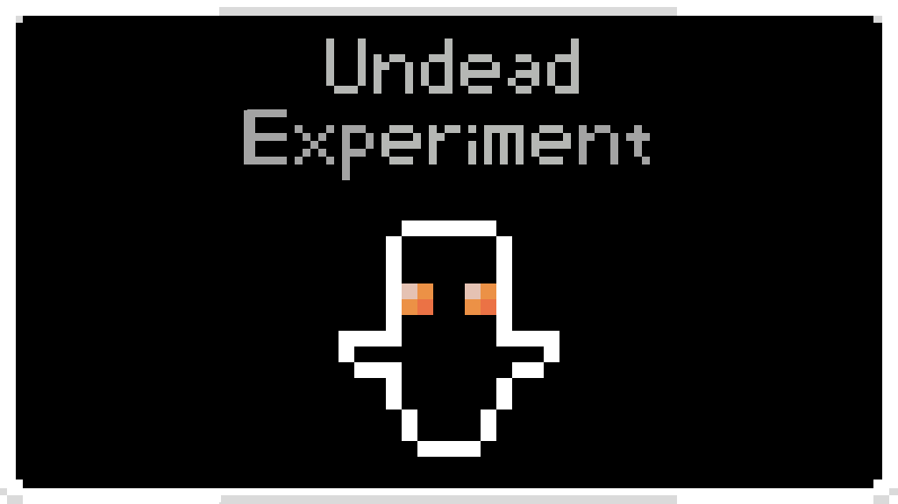


# Undead Experiment
A simple mod, like ever second run `heal` command.

You can customize **all** ***supported*** **healing effects** in the configuration file!

Use the `undeadmode` command **in-game** to toggle Undead Mode!

## Configs `blackmoss.undeadexperiment.cfg`(excluding healing effects):
* `HealCountdown`: The interval between every time heal, *default: 1f*.
* `UndeadMode`: Toggles undead mode on/off.

# 不死Exp
一个简单的模组，功能类似每秒运行一次`heal`命令。

在配置文件中可以**自定义所有*****模组支持*****的治疗效果！**

**在游戏中**运行`undeadmode`命令以启用/禁用不死模式！

## 配置 `blackmoss.undeadexperiment.cfg`（不包括治疗效果）：
* `HealCountdown`：每次治疗的间隔，默认：*1f*
* `UndeadMode`：启用/禁用不死模式。
